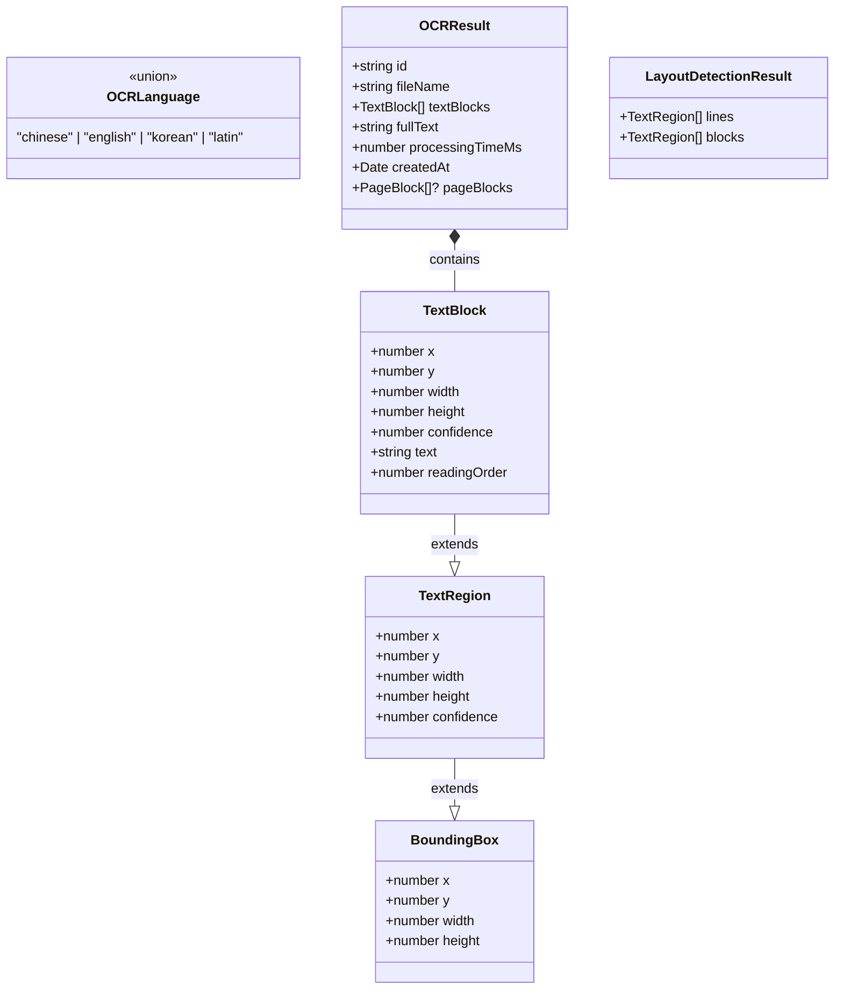
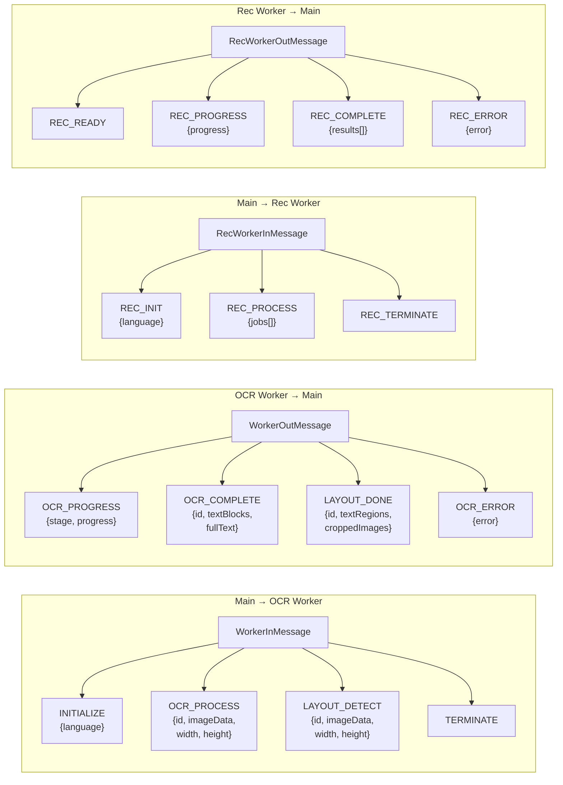

# API・型定義一覧

> 最終更新: 2026-04-10

## 概要

本プロジェクトは `src/types/` に4ファイルの型定義を持ち、OCR パイプラインの入出力・Worker メッセージプロトコル・IndexedDB スキーマを型安全に定義しています。TypeScript strict mode で運用されています。

## コア型定義

### OCR 基本型 (`types/ocr.ts`)

### Worker メッセージプロトコル

### IndexedDB スキーマ (`types/db.ts`)

| ストア | キー | インデックス | フィールド |
|--------|------|-------------|-----------|
| `models` | `name` | — | `name`, `data` (ArrayBuffer), `version` |
| `results` | `id` (UUID) | `by_createdAt` | `id`, `files[]`, `createdAt` |

`files[]` の各要素:
- `fileName`: ファイル名
- `imageDataUrl`: サムネイル (base64)
- `textBlocks`: TextBlock[]
- `fullText`: 結合テキスト

## 主要クラス

### LayoutDetector

レイアウト検出エンジン。PaddleOCR DB モデルを使用。

| メソッド | 入力 | 出力 |
|---------|------|------|
| `initialize(language)` | OCRLanguage | void |
| `detect(imageData, width, height)` | ImageData | LayoutDetectionResult |

前処理仕様:
- リサイズ: `limit_side_len(960)`, 32倍数パディング
- 正規化: ImageNet (mean=[0.485,0.456,0.406], std=[0.229,0.224,0.225])
- テンソル形状: `[1, 3, H, W]` (RGB, NCHW)

### TextRecognizer

文字認識エンジン。PaddleOCR SVTR + CTC デコード。

| メソッド | 入力 | 出力 |
|---------|------|------|
| `initialize(language)` | OCRLanguage | void |
| `recognize(imageData, width, height)` | ImageData (クロップ) | { text, confidence } |

前処理仕様:
- リサイズ: 高さ48px固定、幅8倍数
- 正規化: PaddleOCR (mean=[0.5,0.5,0.5], std=[0.5,0.5,0.5])
- テンソル形状: `[1, 3, 48, W]` (RGB, NCHW)

### ReadingOrderProcessor

読み順推定。XY-Cut 再帰分割アルゴリズム。

| メソッド | 入力 | 出力 |
|---------|------|------|
| `process(textBlocks)` | TextBlock[] | TextBlock[] (readingOrder 付与) |

## Hooks インターフェース

### useOCRWorker(language)

| 返り値 | 型 | 説明 |
|--------|-----|------|
| `isReady` | boolean | Worker 初期化完了 |
| `jobState` | object | 進捗情報 |
| `processImage(img)` | function | 画像 OCR 実行 |
| `processRegion(...)` | function | 領域選択 OCR |

### useFileProcessor()

| 返り値 | 型 | 説明 |
|--------|-----|------|
| `processedImages` | ProcessedImage[] | 変換済み画像リスト |
| `processFiles(files)` | function | ファイル変換実行 |

### useResultCache()

| 返り値 | 型 | 説明 |
|--------|-----|------|
| `runs` | DBRunEntry[] | 履歴一覧 |
| `saveRun(result)` | function | 結果保存 |

## 発見・懸念事項

- **ModelProgress 型**: `{det, rec}` の2モデル想定。言語別に複数 rec_* がある場合の進捗報告方法が不明確
- **Worker メッセージ ID**: `id` が optional のため、複数ジョブ同時投入時の帰属判定が複雑
- **Transferable 指定**: processRegion での `imageData.data.buffer` は明示的に transfer リストに含める必要あり
- **キャッシュ無効化**: `MODEL_VERSION` 更新で models ストアが全削除されるが、results ストアは保持される
