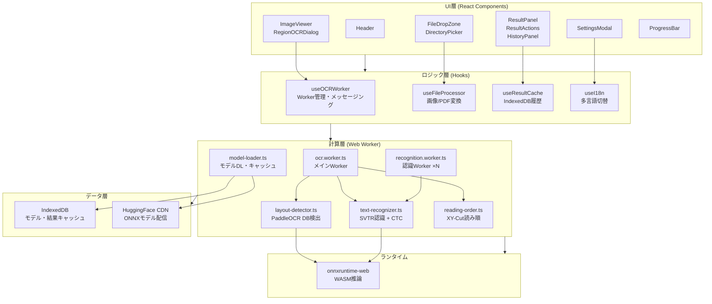

# アーキテクチャ概要・モジュール構成

> 最終更新: 2026-04-10

## 概要

NDLOCR-Lite Web は、PaddleOCR PP-OCRv5 をブラウザネイティブで実行する SPA（React 19 + TypeScript）です。ONNX Runtime Web (WASM) による推論をWeb Workerで並列実行し、画像・PDF からテキストを抽出します。全処理はブラウザ内で完結し、外部サーバーへのデータ送信は一切ありません。

## 技術スタック

| 要素 | 技術 |
|------|------|
| UI フレームワーク | React 19 + TypeScript |
| ビルドツール | Vite |
| OCR 推論エンジン | onnxruntime-web 1.20.0 (WASM CPU) |
| PDF 処理 | pdfjs-dist 4.9.0 |
| 画像形式対応 | heic2any (HEIC), utif (TIFF) |
| テスト | Vitest + @napi-rs/canvas |
| デプロイ | Netlify (自動デプロイ) |

## フォルダ構成

```
web-ocr/
├── index.html                  # HTML エントリーポイント
├── vite.config.ts              # Vite ビルド設定
├── netlify.toml                # Netlify デプロイ設定
├── public/
│   ├── models/                 # ONNX モデルファイル
│   │   ├── det.onnx            # PaddleOCR DB 検出モデル
│   │   └── rec_*.onnx          # 言語別認識モデル
│   └── config/
│       └── paddleocr/          # 言語別文字辞書 (.txt)
├── src/
│   ├── main.tsx                # React エントリーポイント
│   ├── App.tsx                 # アプリケーションルート
│   ├── components/             # UI コンポーネント
│   │   ├── layout/             #   Header, Footer
│   │   ├── upload/             #   FileDropZone, DirectoryPicker
│   │   ├── progress/           #   ProgressBar
│   │   ├── viewer/             #   ImageViewer, RegionOCRDialog
│   │   ├── results/            #   ResultPanel, ResultActions, HistoryPanel
│   │   └── settings/           #   SettingsModal
│   ├── hooks/                  # カスタムフック（ビジネスロジック）
│   ├── worker/                 # Web Worker（OCR計算エンジン）
│   ├── types/                  # TypeScript 型定義
│   ├── utils/                  # ユーティリティ関数
│   └── i18n/                   # 多言語定義 (ja/en/zh/ko)
└── tests/                      # テストスイート
```

## レイヤー構成



## エントリーポイント

| エントリー | ファイル | 役割 |
|-----------|---------|------|
| HTML | `index.html` | SPA シェル + GA スクリプト |
| React | `src/main.tsx` → `App.tsx` | React ルートレンダリング |
| OCR Worker | `src/worker/ocr.worker.ts` | レイアウト検出 + 認識パイプライン |
| 認識 Worker | `src/worker/recognition.worker.ts` | テキスト認識（並列実行用） |

## ビルド・デプロイ構成

### Vite 設定 (`vite.config.ts`)
- `optimizeDeps.exclude`: onnxruntime-web（WASM バイナリ破損防止）
- `assetsInclude`: WASM/ONNX ファイルをアセットとして扱う
- `worker.format: 'es'`: Web Worker を ES Module で出力
- COOP/COEP ヘッダー: SharedArrayBuffer + クロスオリジンモデルDL対応

### Netlify 設定 (`netlify.toml`)
- ビルドコマンド: `npm run build` → `dist/`
- COOP/COEP ヘッダー（全リクエスト）
- SPA フォールバック: `/* → /index.html`

## 発見・懸念事項

- **CPU推論のみ**: WebGPU未対応のため、大きな画像では処理に数十秒かかる可能性がある
- **メモリ使用量**: N本の認識Workerが各自モデルをロードするため、言語によっては640MB超のメモリ消費
- **ブラウザ互換性**: WebAssembly + IndexedDB + Web Worker が必須（レガシーブラウザ非対応）
- **初回ダウンロード**: モデル総量200MB超（検出84MB + 認識7-81MB × 言語数）
