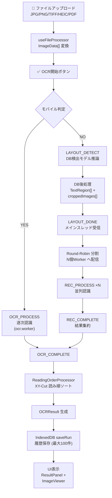
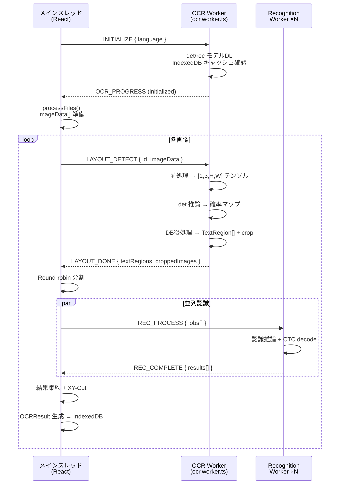
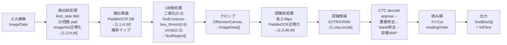
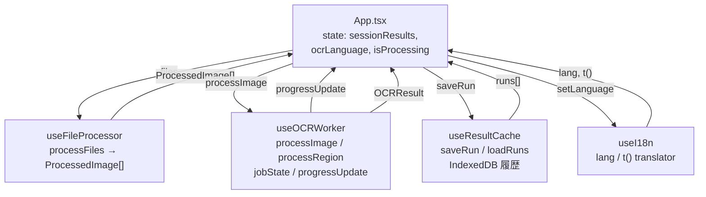
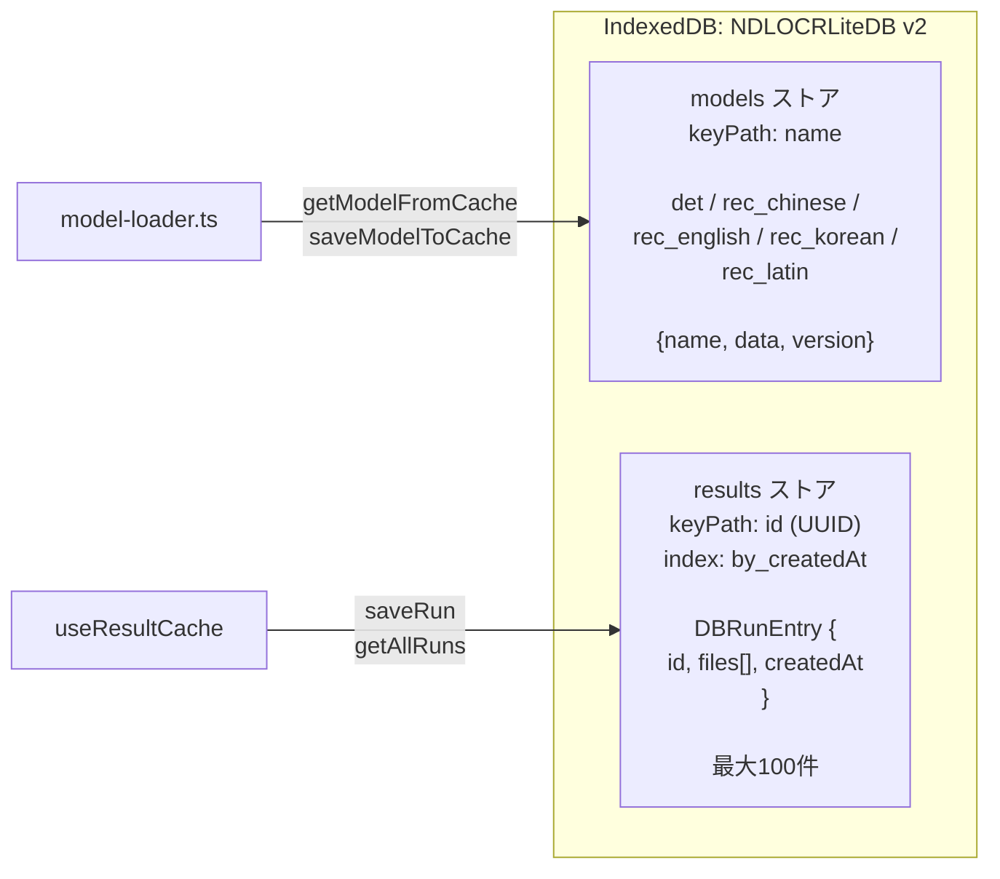

# データフロー・処理パイプライン

> 最終更新: 2026-04-10

## 概要

ユーザーがアップロードした画像/PDF は、メインスレッドで ImageData に変換された後、Web Worker パイプラインで OCR 処理されます。デスクトップではレイアウト検出と文字認識を分離し、N本の認識Workerで並列処理します。モバイルでは単一Workerで逐次処理します。

## 全体フロー

## Worker 通信シーケンス（デスクトップフロー）

## OCR処理パイプライン（ステップ詳細）

## React Hook 連携

## IndexedDB キャッシュ構造

## 重要な技術的特性

| 特性 | 詳細 |
|------|------|
| **Transferable 転送** | croppedImageData の ArrayBuffer を Transferable でゼロコピー転送 |
| **動的テンソル形状** | 認識モデル入力幅が可変（高さ48px固定、幅8倍数） |
| **言語切替** | language 変更時に全 Worker を再初期化（コスト大） |
| **Round-Robin** | 認識バッチを N 個の Worker に均等分配 |

## 発見・懸念事項

- **正規化の違い**: 検出モデルは ImageNet 正規化、認識モデルは PaddleOCR 正規化（mean/std=0.5）。混同すると CJK 文字認識が全滅する
- **言語切替コスト**: ocrLanguage 変更時に OCR Worker + N 個 RecWorker が全て再初期化される
- **Round-Robin の最適性**: CPU コア数より少ない Worker 数で均等分割のため、最適化の余地あり
- **履歴上限**: 100件で自動削除 → 大規模セッションでは早期に古い結果が失われる
