# 依存関係グラフ

> 最終更新: 2026-04-10

## 概要

本プロジェクトは Runtime 5パッケージ + DevDependencies 14パッケージで構成されます。UI層（React）→ ロジック層（Hooks）→ 計算層（Worker）→ 外部ライブラリという4階層の依存構造を持ちます。

## NPM パッケージ依存

### Runtime Dependencies (5)

| パッケージ | バージョン | 用途 |
|-----------|-----------|------|
| react | 19.x | UI フレームワーク |
| react-dom | 19.x | DOM レンダリング |
| onnxruntime-web | 1.20.0 | ONNX 推論エンジン (WASM) |
| pdfjs-dist | 4.9.0 | PDF → ImageData 変換 |
| heic2any | - | HEIC 画像デコード |

### DevDependencies (14)

| パッケージ | 用途 |
|-----------|------|
| typescript | 型チェック |
| vite | ビルドツール |
| vitest | テストフレームワーク |
| @napi-rs/canvas | テスト用 Canvas API |
| onnxruntime-node | テスト用 ONNX ランタイム |
| eslint + plugins | コード品質 |
| @types/react, @types/react-dom | React 型定義 |
| utif | TIFF 画像デコード |

## モジュール間依存グラフ

```mermaid
graph TD
    %% Entry
    main["main.tsx"] --> App["App.tsx"]

    %% App → Hooks
    App --> useI18n["useI18n"]
    App --> useOCR["useOCRWorker"]
    App --> useFP["useFileProcessor"]
    App --> useRC["useResultCache"]

    %% App → Components
    App --> Header["Header"]
    App --> Footer["Footer"]
    App --> FDZ["FileDropZone"]
    App --> DP["DirectoryPicker"]
    App --> PB["ProgressBar"]
    App --> IV["ImageViewer"]
    App --> RP["ResultPanel"]
    App --> RA["ResultActions"]
    App --> HP["HistoryPanel"]
    App --> SM["SettingsModal"]
    App --> ROD["RegionOCRDialog"]

    %% Hooks → Workers
    useOCR -->|"new Worker"| ocrW["ocr.worker.ts"]
    useOCR -->|"new Worker ×N"| recW["recognition.worker.ts"]
    useOCR --> readOrder["reading-order.ts"]

    %% Hooks → Utils
    useFP --> imgLoader["imageLoader.ts"]
    useFP --> pdfLoader["pdfLoader.ts"]
    useRC --> dbUtil["utils/db.ts"]
    App --> imgLoader

    %% Components → Utils
    RA --> textExport["textExport.ts"]
    SM --> dbUtil
    Header --> analytics["analytics.ts"]

    %% Worker internals
    ocrW --> ortConfig["onnx-config.ts"]
    ocrW --> modelLoader["model-loader.ts"]
    ocrW --> layoutDet["layout-detector.ts"]
    ocrW --> textRec["text-recognizer.ts"]
    ocrW --> readOrder

    recW --> ortConfig
    recW --> modelLoader
    recW --> textRec

    %% External libraries
    layoutDet -->|"InferenceSession"| onnx["onnxruntime-web"]
    textRec -->|"InferenceSession"| onnx
    ortConfig --> onnx
    pdfLoader -->|"getDocument"| pdfjs["pdfjs-dist"]
    imgLoader --> heic["heic2any"]
    imgLoader --> utif["utif"]
    modelLoader --> dbUtil
    modelLoader -->|"fetch"| hf["HuggingFace CDN"]

    %% i18n
    useI18n --> i18nFiles["i18n/ja,en,zh,ko"]

    %% Types
    useOCR -.-> typesOCR["types/ocr.ts"]
    useOCR -.-> typesW["types/worker.ts"]
    useOCR -.-> typesRW["types/recognition-worker.ts"]
    dbUtil -.-> typesDB["types/db.ts"]

    style App fill:#ff6b6b,color:#fff
    style useOCR fill:#4ecdc4,color:#fff
    style useFP fill:#4ecdc4,color:#fff
    style ocrW fill:#95e1d3
    style recW fill:#95e1d3
    style onnx fill:#f9ca24
    style pdfjs fill:#f9ca24
```

## 依存強度分類

| 依存元 | 依存先 | 強度 | 備考 |
|--------|--------|------|------|
| App.tsx | useOCRWorker + useFileProcessor | **強** | アプリの中核ロジック |
| useOCRWorker | ocr.worker + recognition.worker | **強** | Worker が推論エンジン |
| ocr.worker | layout-detector + text-recognizer | **強** | OCR パイプライン |
| layout-detector / text-recognizer | onnxruntime-web | **強** | 推論実行に必須 |
| model-loader | IndexedDB + HuggingFace CDN | **中** | キャッシュ失敗時は再DL |
| useFileProcessor | pdfjs-dist + utif + heic2any | **中** | 画像形式ごとの分岐 |
| Components | i18n | **弱** | 言語切替で再レンダリング |

## 発見・懸念事項

- **認識Workerのメモリ多重化**: `N_REC_WORKERS`（最大8本）× 各Workerが言語別 rec.onnx を個別ロード → 最大640MB超のメモリ消費リスク
- **モデルキャッシュ戦略**: `MODEL_VERSION` 変更時に全モデルが再ダウンロード（総200MB超）
- **辞書ファイルの逐次HTTP**: 言語切替時に `public/config/[lang]_dict.txt` を毎回 fetch
- **Worker メッセージプロトコルの分散**: 型定義が `types/worker.ts` と `types/recognition-worker.ts` に分かれており、プロトコルバージョン管理が弱い
