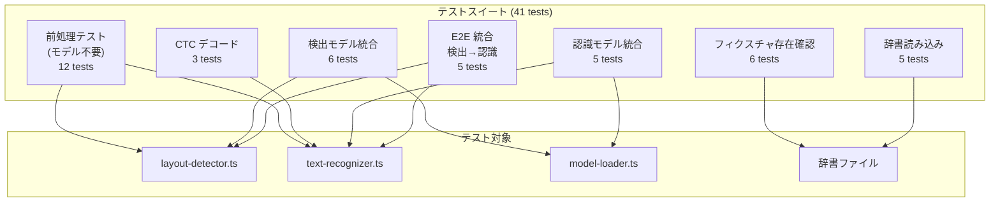
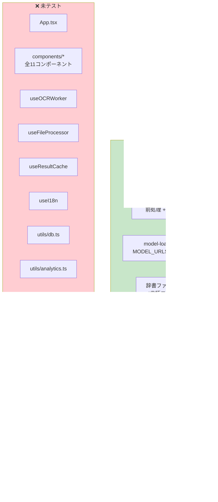

# テストカバレッジ・品質分析

> 最終更新: 2026-04-10

## 概要

テストスイートは Vitest ベースで、単一ファイル `tests/ocr-pipeline.test.ts` に41テストケースが集約されています。OCR パイプラインのコア処理（前処理・検出・認識・CTC デコード）は十分にカバーされていますが、UI/Hook 層・ユーティリティ層は未テストです。

## テスト設定

| 項目 | 設定値 |
|------|--------|
| フレームワーク | Vitest 4.1.4 |
| タイムアウト | 120秒（ONNX モデル DL 考慮） |
| 実行プール | `forks`（onnxruntime-node が個別プロセス必須） |
| テスト検出 | `tests/**/*.test.ts` |
| TypeScript | strict: true, noUnusedLocals/Parameters |
| Lint | ESLint + typescript-eslint + react-hooks + react-refresh |

## テストスイート構成



### テストケース詳細

| セクション | テスト数 | 対象 | 備考 |
|-----------|---------|------|------|
| フィクスチャ存在確認 | 6 | 5言語 PNG + manifest.json | ファイル存在チェック |
| 検出前処理 | 5 | テンソル形状・32倍数・正規化 | モデル不要 |
| 認識前処理 | 5 | テンソル形状・高さ48・正規化 | モデル不要 |
| 正規化値範囲 | 1 | PaddleOCR 正規化確認 | |
| CTC デコード | 3 | シーケンス処理・重複除去・空テキスト | |
| 辞書読み込み | 5 | 4言語辞書 + 日本語ひらがな | |
| 検出モデル統合 | 6 | ONNX 推論 (1+5言語) | 要: モデルDL |
| 認識モデル統合 | 5 | 5言語別モデル | 要: モデルDL |
| E2E 統合 | 5 | クロップ→認識パイプライン | 要: モデルDL |

## カバレッジ分析



### 推定カバレッジ

| 層 | カバレッジ | 詳細 |
|----|-----------|------|
| Worker (計算層) | **70-80%** | 検出/認識前処理, CTC, DB後処理 ✅ / reading-order ❌ |
| Hooks (ロジック層) | **0%** | 全フック未テスト |
| Utils (ユーティリティ) | **5-10%** | model-loader の URL 間接参照のみ |
| Components (UI層) | **0%** | 全コンポーネント未テスト |
| **全体** | **推定 15-20%** | |

## テストインフラ

### テストヘルパー (`test-helpers.ts`)

| 関数 | 用途 |
|------|------|
| `downloadModel()` | HuggingFace CDN → `.model-cache/` |
| `createTestSession()` | onnxruntime-node CPU セッション生成 |
| `loadPngAsImageData()` | @napi-rs/canvas で PNG デコード |
| `preprocessForDetection()` | 検出前処理テンソル化 |
| `preprocessForRecognition()` | 認識前処理テンソル化 |
| `dbPostprocess()` | DB後処理（二値化→ラベリング→unclip） |
| `ctcDecode()` | CTC Greedy Decode |
| `loadDict()` | 辞書ファイル読み込み |

### テストフィクスチャ

```
tests/fixtures/
├── manifest.json                    # 言語別テスト仕様
├── hello-{japanese,korean,chinese,english,latin}.png  # 5言語テスト画像
├── hello-{japanese,korean,chinese,english,latin}.pdf  # 5言語テストPDF
└── .model-cache/                    # モデルキャッシュ
    ├── det.onnx                     # ~84MB
    ├── rec_chinese.onnx             # ~81MB
    ├── rec_english.onnx             # ~7.5MB
    ├── rec_korean.onnx              # ~13MB
    └── rec_latin.onnx
```

## 品質評価

| 評価項目 | スコア | 備考 |
|---------|--------|------|
| テスト設計（段階的） | A | フィクスチャ→前処理→推論→E2E |
| 多言語対応 | A | 5言語フィクスチャ |
| 前処理検証 | A | テンソル形状・正規化値確認 |
| E2E カバレッジ | A | パイプライン全体 |
| エラー処理テスト | C | 部分的（空結果スキップのみ） |
| ブラウザ環境テスト | F | Canvas/IndexedDB/Worker なし |
| UI コンポーネントテスト | F | なし |
| エッジケース | D | 小画像・大画像・回転など未検証 |
| パフォーマンステスト | F | なし |

## 発見・懸念事項

- **単一テストファイル**: 41テストが1ファイルに集約されており、スケーリング時に管理困難
- **UI/Hook 層が完全未テスト**: `useOCRWorker` の Worker 通信、`useResultCache` の IndexedDB 操作が未検証
- **reading-order.ts（XY-Cut）が完全未テスト**: ブロック配置アルゴリズムの正確性が未確認
- **ブラウザ特有機能の未テスト**: Canvas リサイズ、IndexedDB CRUD、Web Worker メッセージング
- **前処理の正規化値が緩い条件**: `expect(min).toBeGreaterThan(-3.0)` など、厳密な値チェックではない

---

## TODO: テスト改善 PR 計画

> **ブランチ**: `test/improve-coverage` (フォーク先で作成 → 上流へ PR)

### PR #1: テストファイル分割 + reading-order テスト
- [ ] `tests/ocr-pipeline.test.ts` を機能単位に分割
  - `tests/preprocessing.test.ts` — 検出/認識前処理 (12 tests)
  - `tests/ctc-decode.test.ts` — CTC デコード (3 tests)
  - `tests/dict-loading.test.ts` — 辞書読み込み (5 tests)
  - `tests/detection-model.test.ts` — 検出モデル統合 (6 tests)
  - `tests/recognition-model.test.ts` — 認識モデル統合 (5 tests)
  - `tests/e2e-pipeline.test.ts` — E2E 統合 (5 tests)
- [ ] `tests/reading-order.test.ts` を新規作成
  - 単一カラムレイアウトの読み順テスト
  - 2段組レイアウトの読み順テスト
  - 混合レイアウト（見出し + 本文 + 図キャプション）のテスト
  - 空入力・単一ブロックのエッジケース

### PR #2: ユーティリティ層テスト
- [ ] `tests/utils/text-export.test.ts` — テキスト/CSV エクスポートのフォーマット検証
- [ ] `tests/utils/image-loader.test.ts` — 画像フォーマット判定・デコード（JPEG, PNG のみ。HEIC/TIFF は @napi-rs/canvas 依存のため mock）
- [ ] `tests/utils/db.test.ts` — IndexedDB 操作の単体テスト（fake-indexeddb を導入）
  - saveRun / getAllRuns / 100件上限削除 / clearModels
- [ ] `tests/utils/pdf-loader.test.ts` — PDF → ImageData 変換の基本テスト

### PR #3: Hook 層テスト（jsdom/happy-dom）
- [ ] `vitest.config.ts` に `environment: 'jsdom'` の別設定を追加（または vitest workspace）
- [ ] `tests/hooks/useI18n.test.ts` — 言語切替・localStorage 永続化・翻訳キー解決
- [ ] `tests/hooks/useResultCache.test.ts` — IndexedDB mock によるキャッシュ CRUD
- [ ] `tests/hooks/useFileProcessor.test.ts` — ファイル種別判定・ProcessedImage 変換（画像 mock）
- [ ] `tests/hooks/useOCRWorker.test.ts` — Worker mock による初期化・メッセージ送受信・言語切替

### PR #4: エッジケース + エラー処理テスト
- [ ] 極小画像（1×1px, 10×10px）の検出前処理・認識前処理
- [ ] 極大画像（4000×6000px）の `limit_side_len(960)` リサイズ動作
- [ ] 空ファイル / 破損ファイルのエラーハンドリング
- [ ] Worker 初期化失敗時のリカバリ（モデル DL タイムアウト等）
- [ ] 認識結果が空文字列のケース（英語/韓国語モデルでの既知問題）
- [ ] 言語切替中に OCR ジョブが進行中の場合の状態管理
