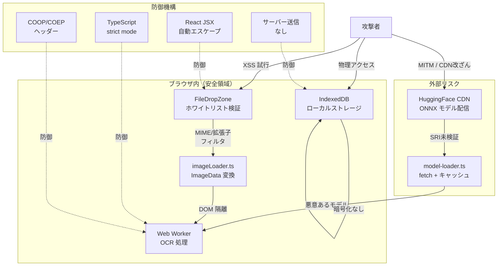

# セキュリティ・脆弱性チェック

> 最終更新: 2026-04-10

## 概要

全処理がブラウザ内で完結するアーキテクチャのため、基本的なセキュリティリスクは低いです。しかし、**HuggingFace CDN からのモデルダウンロード時に SRI（Subresource Integrity）検証がない**点が最大の懸念事項です。

## 全体リスク評価: **中**

## 脅威モデル



## OWASP Top 10 照合

| OWASP リスク | 該当箇所 | 評価 | 詳細 |
|-------------|---------|------|------|
| A01 Broken Access Control | localStorage | **低** | 言語設定のみ、機密情報なし |
| A02 Cryptographic Failures | CDN モデル DL | **中** | SRI/ハッシュ検証なし |
| A03 Injection | テキスト処理 | **低** | innerHTML/eval 未使用 |
| A04 Insecure Design | Worker 通信 | **低** | 型安全な postMessage |
| A05 Security Misconfiguration | CSP ヘッダー | **低** | netlify.toml で設定済み |
| A06 Vulnerable Components | utif, onnxruntime-web | **中** | npm audit 要確認 |
| A07 Auth Failures | — | **N/A** | 認証機能なし |
| A08 Data Integrity | モデル DL | **中** | SRI 未実装 |
| A09 Logging/Monitoring | Google Analytics | **低** | ユーザー通知あり |
| A10 SSRF | — | **N/A** | サーバーサイド処理なし |

## セキュリティチェック結果

### ✅ 安全に実装された領域

| 領域 | 実装状況 |
|------|---------|
| XSS 対策 | `dangerouslySetInnerHTML`, `innerHTML`, `eval` の使用なし |
| 入力検証 | ファイルアップロードの MIME type/拡張子ホワイトリスト |
| データ保護 | 画像・OCR結果は IndexedDB にローカル保存のみ |
| Worker 通信 | 型安全な `postMessage` (WorkerInMessage/OutMessage) |
| クリップボード | `navigator.clipboard` API 使用 |
| HTTPS | Netlify 自動 HTTPS |
| CORS | COOP/COEP ヘッダー設定済み |
| React JSX | 自動エスケープ |
| TypeScript | strict mode |

### ⚠️ セキュリティリスク

| 優先度 | リスク | 箇所 | 脅威 | 推奨対策 |
|--------|--------|------|------|---------|
| **高** | SRI 検証の欠落 | `model-loader.ts` | CDN モデル改ざん→悪意あるコード実行 | SHA256 ハッシュ検証の実装 |
| **高** | Content-Type 偽装 | `model-loader.ts` | HTML応答チェックのみ → バイナリ改ざんに無防備 | `crypto.subtle.digest` でハッシュ比較 |
| **中** | GA追跡ID のハードコード | `index.html` | `G-N5GPX8YPFL` が公開リポジトリに露出 | 環境変数化 |
| **中** | utif ライブラリ | `package.json` | malformed TIFF による DoS の可能性 | バージョン監視・npm audit 定期実行 |
| **低** | IndexedDB 未暗号化 | `utils/db.ts` | 物理アクセスによるデータ窃取 | ローカルのみのため低リスク |
| **低** | localStorage | `i18n/index.ts` | 言語設定のみ保存 | 実害なし |

## 機密情報の取り扱い

### 保存対象データ

| ストア | データ内容 | 機密性 |
|--------|-----------|--------|
| IndexedDB `models` | ONNX バイナリ（平文） | 低（公開モデル） |
| IndexedDB `results` | OCR結果テキスト + サムネイル | 中（ユーザー文書内容） |
| localStorage | UI言語設定 | なし |

### 外部通信

| 通信先 | 送信データ | 検証方法 |
|--------|-----------|---------|
| HuggingFace CDN | — (DL のみ) | HTTP ステータス + Content-Type のみ |
| Google Analytics | ページビュー, イベント | HTTPS |
| その他 | **なし** | — |

## 推奨対応

### Priority 1: SRI/ハッシュ検証

```typescript
// model-loader.ts に SHA256 検証を追加
const modelHash = await crypto.subtle.digest('SHA-256', modelData);
if (toHex(modelHash) !== expectedHash) {
  throw new Error('Model integrity check failed');
}
```

### Priority 2: CSP ヘッダー強化

```toml
# netlify.toml
[[headers]]
  for = "/*"
  [headers.values]
    Content-Security-Policy = "default-src 'self'; script-src 'self' https://www.googletagmanager.com; connect-src 'self' https://huggingface.co https://www.google-analytics.com"
```

### Priority 3: 依存ライブラリ監査

- `npm audit` の定期実行
- Dependabot / Renovate の有効化

## 発見・懸念事項

- **最大の懸念**: HuggingFace CDN からのモデルダウンロードに SRI/ハッシュ検証がなく、中間者攻撃によるモデル改ざんリスクがある
- **GA ID の公開**: 機能面のリスクはないが、プライバシーポリシーの観点で環境変数化が望ましい
- **ブラウザ完結が最大の防御**: サーバーサイドコンポーネントがないため、SSRF・認証・セッション管理の脆弱性は構造的に排除されている

---

## TODO: セキュリティ改善 PR 計画

> **ブランチ**: `fix/security-hardening` (フォーク先で作成 → 上流へ PR)

### PR #1: モデルダウンロードの整合性検証
- [ ] `src/worker/model-loader.ts` に SHA-256 ハッシュ定数を追加（各モデルファイルのハッシュ値を事前計算）
- [ ] `crypto.subtle.digest('SHA-256', arrayBuffer)` でダウンロード後に検証するユーティリティ関数を実装
- [ ] ハッシュ不一致時のエラーハンドリング（リトライ + ユーザー通知）
- [ ] 既存の Content-Type チェックをハッシュ検証に置換
- [ ] テスト: ハッシュ一致/不一致ケースの単体テスト追加

### PR #2: CSP ヘッダー強化
- [ ] `netlify.toml` に `Content-Security-Policy` ヘッダーを追加
  - `default-src 'self'`
  - `script-src 'self' https://www.googletagmanager.com`
  - `connect-src 'self' https://huggingface.co https://www.google-analytics.com`
  - `worker-src 'self' blob:`
  - `style-src 'self' 'unsafe-inline'`
- [ ] ローカル開発環境での CSP 動作確認（vite.config.ts のヘッダーにも同等設定）
- [ ] CSP 違反レポートの確認（ブラウザ DevTools Console）

### PR #3: GA 追跡 ID の環境変数化
- [ ] `VITE_GA_MEASUREMENT_ID` 環境変数を導入
- [ ] `index.html` の GA スクリプトを Vite の環境変数で動的注入に変更
- [ ] `.env.example` にプレースホルダーを記載
- [ ] Netlify 環境変数に本番値を設定する手順を README に追記
- [ ] GA ID 未設定時はスクリプト挿入をスキップする分岐

### PR #4: 依存ライブラリ監査の自動化
- [ ] `.github/dependabot.yml` を追加（npm ecosystem, weekly）
- [ ] `npm audit` を CI に組み込み（GitHub Actions workflow）
- [ ] `utif` のバージョン固定とセキュリティノートの追加
- [ ] `package-lock.json` の既知脆弱性を解消
