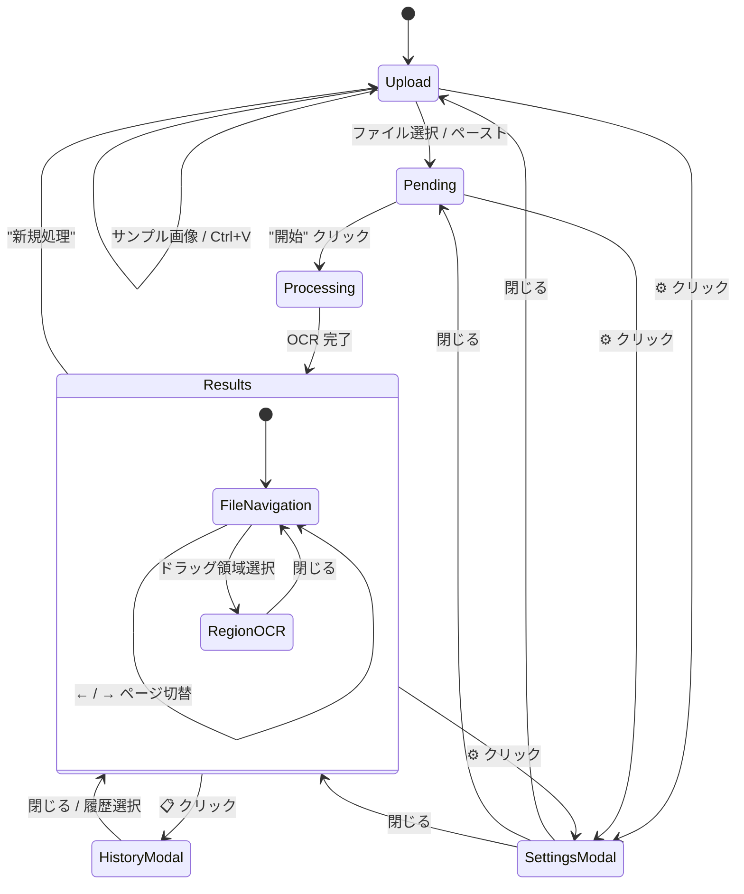
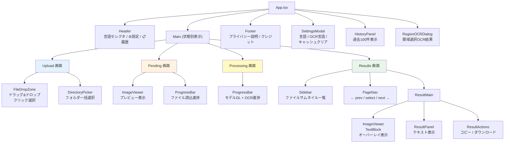
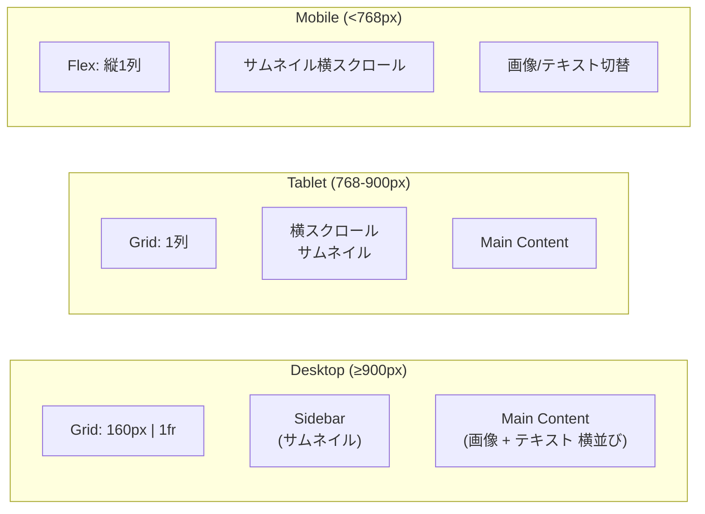

# 画面構成・UIフロー

> 最終更新: 2026-04-10

## 概要

NDLOCR-Lite Web は単一ページアプリケーション（SPA）で、App.tsx の状態に応じて Upload → Pending → Processing → Results の4画面を切り替えます。モーダルとして SettingsModal, HistoryPanel, RegionOCRDialog が重畳表示されます。レスポンシブデザインで Desktop/Tablet/Mobile に対応しています。

## 画面遷移図



## コンポーネントツリー



## 画面詳細

### Upload 画面

```
┌──────────────────────────────────────┐
│ Header [言語▼] [⚙] [📋]            │
├──────────────────────────────────────┤
│                                      │
│    ┌─────────────────────────┐       │
│    │   📁 ドラッグ&ドロップ   │       │
│    │   または クリック        │       │
│    │   Ctrl+V で貼り付け     │       │
│    └─────────────────────────┘       │
│                                      │
│    [📂 フォルダ選択]                  │
│    [🖼 サンプル画像を試す]            │
│                                      │
├──────────────────────────────────────┤
│ Footer                               │
└──────────────────────────────────────┘
```

対応形式: JPG, PNG, TIFF, HEIC, PDF（複数ページ）

### Results 画面 (Desktop)

```
┌──────────────────────────────────────────┐
│ Header [言語▼] [⚙] [📋]                │
├────────┬─────────────────────────────────┤
│ Side   │ ← Page 1/5 →                   │
│ bar    ├─────────────┬───────────────────┤
│        │             │ OCR結果テキスト    │
│ 📄 1  │   画像      │                   │
│ 📄 2  │   ビューア  │ [✓ファイル名含む] │
│ 📄 3  │   (TextBlock│ [✓改行無視]       │
│ 📄 4  │    overlay) │                   │
│ 📄 5  │             │ [📋コピー]        │
│        │             │ [💾DL(現在)]      │
│        │             │ [💾DL(全体)]      │
├────────┴─────────────┴───────────────────┤
│ Footer                                    │
└──────────────────────────────────────────┘
```

- ImageViewer: TextBlock 矩形をオーバーレイ表示、クリックで該当テキストのハイライト
- マウスドラッグ: 任意領域を選択 → RegionOCRDialog で即時OCR

### RegionOCRDialog (モーダル)

```
┌──────────────────────┐
│ 領域OCR結果            │
├──────────────────────┤
│ [選択領域のプレビュー] │
│                       │
│ ┌───────────────────┐ │
│ │ 認識テキスト       │ │
│ │ (textarea)        │ │
│ └───────────────────┘ │
│ [📋コピー] [✕閉じる] │
└──────────────────────┘
```

## レスポンシブレイアウト



## i18n（多言語対応）

| 言語 | ファイル | localStorage キー |
|------|---------|------------------|
| 日本語 | `i18n/ja.ts` | `ndlocr-lite-lang` |
| English | `i18n/en.ts` | |
| 中文 | `i18n/zh.ts` | |
| 한국어 | `i18n/ko.ts` | |

実装方式:
- `createTranslator(lang)` で翻訳関数 `t()` を生成
- ネスト記法: `t("upload.dropzone")` → `obj.upload.dropzone`
- 各コンポーネントが `t()` を直接呼び出し
- 言語選択は localStorage に永続化

## 発見・懸念事項

- **モーダルの積層管理**: HistoryPanel, SettingsModal, RegionOCRDialog は overlay 表示だが、複数同時表示の制御が明示的でない
- **App.tsx の state 過多**: sessionResults, selectedResultIndex, showHistory, showSettings 等、多数の state が集中している
- **Pending vs Results での ImageViewer**: 同一コンポーネントだが props の使い分けが暗黙的
- **クリップボードペースト**: Upload 画面表示中のみ有効、処理中は自動無効化
